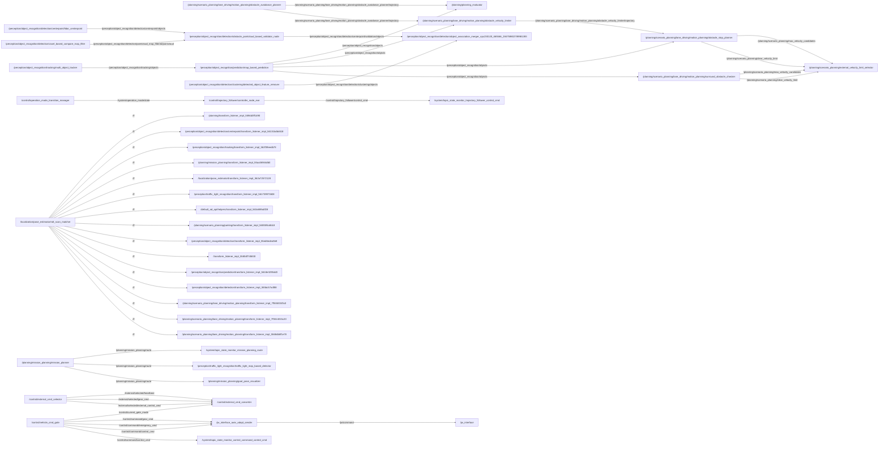

```mermaid
graph LR
/planning/scenario_planning/lane_driving/motion_planning/surround_obstacle_checker--> |/planning/scenario_planning/clear_velocity_limit| /planning/scenario_planning/external_velocity_limit_selector
/planning/scenario_planning/lane_driving/motion_planning/obstacle_stop_planner--> |/planning/scenario_planning/clear_velocity_limit| /planning/scenario_planning/external_velocity_limit_selector
/planning/scenario_planning/lane_driving/motion_planning/surround_obstacle_checker--> |/planning/scenario_planning/max_velocity_candidates| /planning/scenario_planning/external_velocity_limit_selector
/planning/scenario_planning/lane_driving/motion_planning/obstacle_stop_planner--> |/planning/scenario_planning/max_velocity_candidates| /planning/scenario_planning/external_velocity_limit_selector
/planning/scenario_planning/lane_driving/motion_planning/obstacle_avoidance_planner--> |/planning/scenario_planning/lane_driving/motion_planning/obstacle_avoidance_planner/trajectory| /planning/scenario_planning/lane_driving/motion_planning/obstacle_velocity_limiter
/planning/scenario_planning/lane_driving/motion_planning/obstacle_avoidance_planner--> |/planning/scenario_planning/lane_driving/motion_planning/obstacle_avoidance_planner/trajectory| /planning/planning_evaluator
/planning/scenario_planning/lane_driving/motion_planning/obstacle_velocity_limiter--> |/planning/scenario_planning/lane_driving/motion_planning/obstacle_velocity_limiter/trajectory| /planning/scenario_planning/lane_driving/motion_planning/obstacle_stop_planner
/perception/object_recognition/prediction/map_based_prediction--> |/perception/object_recognition/objects| /planning/scenario_planning/lane_driving/motion_planning/surround_obstacle_checker
/perception/object_recognition/prediction/map_based_prediction--> |/perception/object_recognition/objects| /planning/scenario_planning/lane_driving/motion_planning/obstacle_stop_planner
/perception/object_recognition/prediction/map_based_prediction--> |/perception/object_recognition/objects| /planning/scenario_planning/lane_driving/motion_planning/obstacle_velocity_limiter
/perception/object_recognition/prediction/map_based_prediction--> |/perception/object_recognition/objects| /planning/planning_evaluator
/perception/object_recognition/detection/voxel_based_compare_map_filter--> |/perception/object_recognition/detection/pointcloud_map_filtered/pointcloud| /perception/object_recognition/detection/obstacle_pointcloud_based_validator_node
/perception/object_recognition/detection/obstacle_pointcloud_based_validator_node--> |/perception/object_recognition/detection/centerpoint/validation/objects| /perception/object_recognition/detection/object_association_merger_npc230120_665566_284759802789981393
/perception/object_recognition/detection/clustering/detected_object_feature_remover--> |/perception/object_recognition/detection/clustering/objects| /perception/object_recognition/detection/object_association_merger_npc230120_665566_284759802789981393
/localization/pose_estimator/ndt_scan_matcher--> |/tf| /planning/scenario_planning/lane_driving/motion_planning/transform_listener_impl_5568db8f1e78
/localization/pose_estimator/ndt_scan_matcher--> |/tf| /planning/scenario_planning/lane_driving/motion_planning/transform_listener_impl_7f5514015c20
/localization/pose_estimator/ndt_scan_matcher--> |/tf| /planning/scenario_planning/lane_driving/motion_planning/transform_listener_impl_7f555001f0c0
/localization/pose_estimator/ndt_scan_matcher--> |/tf| /perception/object_recognition/detection/transform_listener_impl_555bc57a4f88
/localization/pose_estimator/ndt_scan_matcher--> |/tf| /perception/object_recognition/prediction/transform_listener_impl_5618e32954d0
/localization/pose_estimator/ndt_scan_matcher--> |/tf| /transform_listener_impl_5580df745830
/localization/pose_estimator/ndt_scan_matcher--> |/tf| /perception/object_recognition/detection/transform_listener_impl_55ed6edea9e8
/localization/pose_estimator/ndt_scan_matcher--> |/tf| /planning/scenario_planning/parking/transform_listener_impl_56006f4a5b18
/localization/pose_estimator/ndt_scan_matcher--> |/tf| /default_ad_api/helpers/transform_listener_impl_563a889a0f28
/localization/pose_estimator/ndt_scan_matcher--> |/tf| /perception/traffic_light_recognition/transform_listener_impl_561739973608
/localization/pose_estimator/ndt_scan_matcher--> |/tf| /localization/pose_estimator/transform_listener_impl_562a72572128
/localization/pose_estimator/ndt_scan_matcher--> |/tf| /planning/mission_planning/transform_listener_impl_55aa36944db0
/localization/pose_estimator/ndt_scan_matcher--> |/tf| /perception/object_recognition/tracking/transform_listener_impl_562f39eedb78
/localization/pose_estimator/ndt_scan_matcher--> |/tf| /perception/object_recognition/detection/centerpoint/transform_listener_impl_56131bdb4618
/localization/pose_estimator/ndt_scan_matcher--> |/tf| /planning/transform_listener_impl_5594d3ff1490
/planning/mission_planning/mission_planner--> |/planning/mission_planning/route| /planning/mission_planning/goal_pose_visualizer
/planning/mission_planning/mission_planner--> |/planning/mission_planning/route| /perception/traffic_light_recognition/traffic_light_map_based_detector
/planning/mission_planning/mission_planner--> |/planning/mission_planning/route| /system/topic_state_monitor_mission_planning_route
/perception/object_recognition/tracking/multi_object_tracker--> |/perception/object_recognition/tracking/objects| /perception/object_recognition/prediction/map_based_prediction
/perception/object_recognition/detection/centerpoint/lidar_centerpoint--> |/perception/object_recognition/detection/centerpoint/objects| /perception/object_recognition/detection/obstacle_pointcloud_based_validator_node
/control/trajectory_follower/controller_node_exe--> |/control/trajectory_follower/control_cmd| /system/topic_state_monitor_trajectory_follower_control_cmd
/control/external_cmd_selector--> |/external/selected/external_control_cmd| /control/external_cmd_converter
/control/external_cmd_selector--> |/external/selected/gear_cmd| /control/external_cmd_converter
/control/external_cmd_selector--> |/external/selected/heartbeat| /control/external_cmd_converter
/control/vehicle_cmd_gate--> |/control/command/control_cmd| /system/topic_state_monitor_control_command_control_cmd
/control/vehicle_cmd_gate--> |/control/command/control_cmd| /jw_interface_awiv_adapt_sender
/control/vehicle_cmd_gate--> |/control/command/emergency_cmd| /jw_interface_awiv_adapt_sender
/control/vehicle_cmd_gate--> |/control/command/gear_cmd| /jw_interface_awiv_adapt_sender
/control/vehicle_cmd_gate--> |/control/current_gate_mode| /control/external_cmd_converter
/control/operation_mode_transition_manager--> |/system/operation_mode/state| /control/trajectory_follower/controller_node_exe
/jw_interface_awiv_adapt_sender--> |/jw/command| /jw_interface
```

